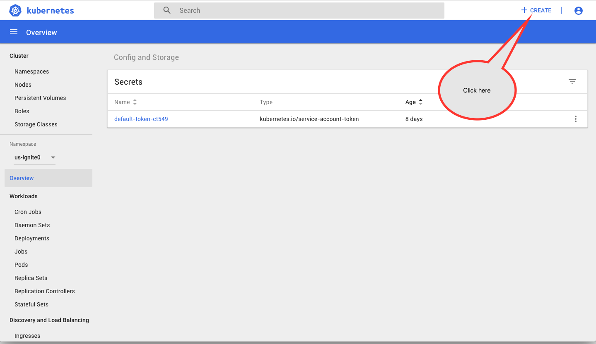
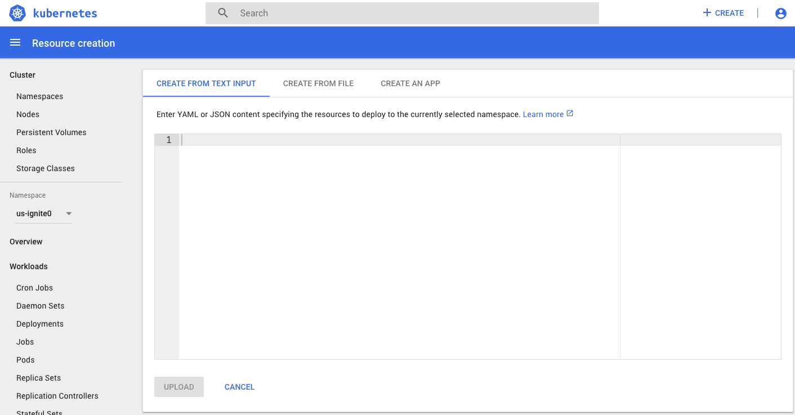
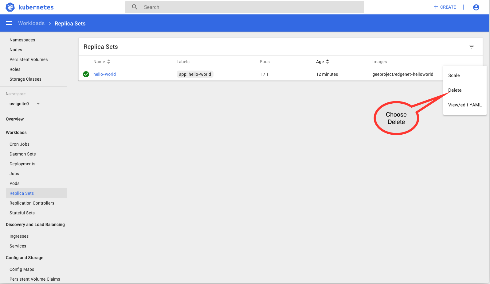
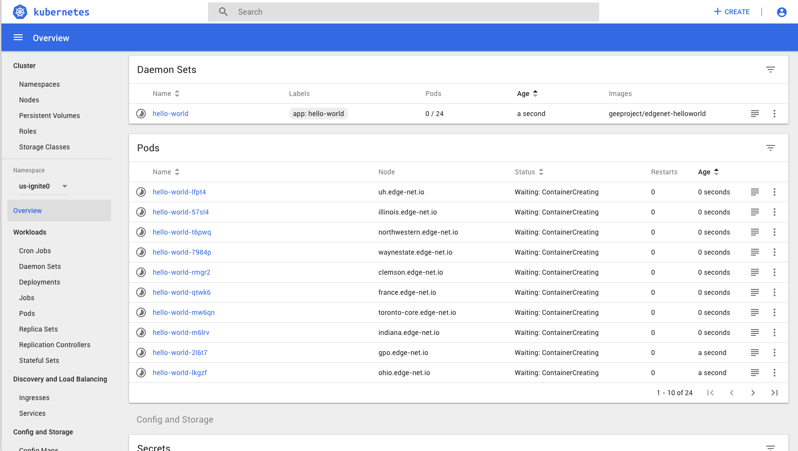

---
---
# Hello, World, on EdgeNet
In this tutorial, we're going to show you how to deploy a minimal experiment across EdgeNet and use it.  This tutorial assumes that you're using some Unix-derived system, such as Linux, Max OSX, or a Linux-based VM on Windows.  It's likely a cygwin environment will work on Windows as well, but I haven't tried that.
## Have on Hand
Software you should have installed to run this tutorial:

1. [Docker](https://www.docker.com/)
2. [node.js](https://nodejs.org/en/)

Very helpful:

1. [kubectl](https://kubernetes.io/docs/tasks/tools/install-kubectl/). This is to control and query Kubernetes from your desktop rather than use the dashboard, though you can do everything on the dashboard.
2. [Minikube](https://kubernetes.io/docs/setup/minikube/). This lets you run a Kubernetes cluster on your laptop, very handy for testing.

As a note, node.js isn't essential.  We're just going to write a simple request/response HTTP server to do Hello, World, so if you prefer another server feel free.  It just need to serve a get request with an argument, and echo back the argument.

## Read Ahead of Time

1. [Hello, Minikube](https://kubernetes.io/docs/tutorials/hello-minikube/)
2. [Hello, World in Kubernetes](https://kubernetes-v1-4.github.io/docs/hellonode/)
3. [Docker Tutorial](https://docs.docker.com/get-started/)
4. [Using EdgeNet](https://edge-net.org/using_EdgeNet.html)

You should also be familiar enough with node.js or whatever server you've chosen that you can write a simple request/response server in it.   We won't be covering how to do that here.

## Preparation

1. Download your config file from the portal and save a copy as $HOME/.kube/config.  This is where Kubernetes looks for a configuration file.  (see [Using EdgeNet](https://edge-net.org/using_EdgeNet.html) for how to download a config file)/
2. Run `$ kubectl get ns` if you've installed kubectl to make sure that you're talking to the right cluster.
3. Ensure that you have a [Docker Hub](https://hub.docker.com/) account.  Docker is used to pull images onto your Services and Docker Hub is an extremely convenient place to pull from.

## Write and Test Your Server
This section assumes that we're using node.js as the server.  If you are not using node.js, modify this section for the server that you're using.  We used the following code:

```javascript
const http = require('http');
const url = require('url');
const port = 8080; // note: you should modify this because at the moment we haven't taken care of port contention
const handleRequest = function(request, response) {
  const parsedRequest = url.parse(request.url, true);
  
  response.writeHead(200);
  response.end("Hello, World, from " + parsedRequest.query.hostname +"!\n");
}
var www = http.createServer(handleRequest);
www.listen(port);
```

Save the file in server.js.

_Warning!_  Use Javascript constructs with some care.  In particular, don't use modern ECMAScript constructs such as '=>' for functions unless you're prepared to control the node.js version in your Docker container.  See below.

Test the server by running

```bash 
$ node server.js
```

and then, in any browser, go to `http://localhost:8080/hello?hostname=foo`.  You should see `Hello, World, from foo!`.  You can also try 

```bash
$ curl http://localhost:8080/hello?hostname=foo
``` 
and you should see the same thing.

_Note_: in the above, change 8080 to whatever random port you picked for your server.

Kill the server and go on to the next step.

## Build, Test, and Push the Docker File
The next step is to containerize the Hello, World application, test it, and push it to Docker Hub so it can be loaded.  In the same directory, write the following markup:

```bash
FROM node:4.4
EXPOSE 8080
COPY server.js .
CMD node server.js
```

_Note_: in the above, change 8080 to whatever random port you picked for your server.  Save this into `dockerfile` (note: no extension) and run:

```bash
$ docker build -t  <username>/edgenet-helloworld .
```

where `<username>` is your Docker Hub user name.

Once the build has been successfully completed, we're ready to test.  On your local host, run:

```bash
$ docker run -p 8080:8080 -d  <username>/edgenet-helloworld
```

As always, substitute the random port number you chose for 8080 in the above.  Make sure the container is  running with `docker ps`.  You should see something like:

```bash
CONTAINER ID        IMAGE                           COMMAND                  CREATED             STATUS              PORTS                    NAMES
67b44219b1a4        geeproject/edgenet-helloworld   "/bin/sh -c 'node se…"   27 hours ago        Up 27 hours         0.0.0.0:8080->8080/tcp   pensive_austin
```

If this is all working, repeat the test in your browser and/or with `curl`.  When you see `Hello, World, from foo!`, kill the container with

```bash
$ docker stop 67b4
```

(substitute the first few digits of your container ID from the `$ docker ps` command above).

Finally, push your container to Docker Hub.  Run:

```bash
$ docker push <username>/edgenet-helloworld
```

to push to Docker Hub.

## Deploy a Service on EdgeNet
Log in to the [EdgeNet head node](https://headnode.edge-net.org/) following the directions in [Using EdgeNet](https://edge-net.org/using_EdgeNet.html).  Once you are logged in and have chosen your namespace, you should see .

Click the Create Button in the top right.  You should see .  Enter the following YAML code into the text box:

```yaml
apiVersion: extensions/v1beta1
kind: ReplicaSet
metadata:
  name: hello-world
spec:
  template:
    metadata:
      labels:
        app: hello-world
    spec:
      hostNetwork: true           
      containers:
        - name: hello-world
          image: <username>/edgenet-helloworld
          ports:
          - containerPort: <your port>
            hostPort: <your port>
```

Where, as alwayus <username> is your Docker Hub username and <your port> is the random port you've chosen.  Hit `Upload`.  

The line `hostNetwork:true` tells Kubernetes to expose the ports from the Pod.  A `ReplicaSet` is a number of Pods placed in the cluster; in this case, we have chosen one, and since we didn't specify where this should be placed it will be placed at a node chosen by Kubernetes.  You should now see this: .  Supposing the node is `toronto.edge-net.io` as shown above, you can now test with any browser by navigating to `http://toronto.edge-net.io:<port-number>/hello?hostname=Toronto` or with

```bash
$ curl http://toronto.edge-net.io:<port-number>/hello?hostname=Toronto
```

And get "Hello, World, from Toronto!"

Clicking on the links and menus will give you various views into your ReplicaSet.  Play around with them and see what you can find out.  When you're done, choose Delete from the right-hand menu in ReplicaSets .  It may take a few minutes to delete.

## A DaemonSet and Using `kubectl`
In this last section we're going to make `hello-world` run on _every_ node in EdgeNet.  And it's just as easy as it was to run on a single node.  

Once again, go to the EdgeNet dashboard and click the Create button in the top right.  This time, when the wizard comes up, enter this YAML code into the text box:

```yaml
apiVersion: extensions/v1beta1
kind: DaemonSet
metadata:
  name: hello-world
spec:
  template:
    metadata:
      labels:
        app: hello-world
    spec:
      hostNetwork: true           
      containers:
        - name: hello-world
          image: <username>/edgenet-helloworld
          ports:
          - containerPort: <your port>
            hostPort: <your port>
```

Notice that the change from our previous YAML is _one word_: DaemonSet replaces ReplicaSet.  But this gives a dramatic change in result, as we'll see.  Click Upload.  Uou will now see this: .  _24 pods running, one on every active EdgeNet node!_.  Of course, to test this we don't want to manually type in every one, so we'll download the names of the nodes using `kubectl`.

In a terminal window, type

```bash
$ kubectl get pods -o wide
```

You'll get an output like this:

```bash
NAME                READY     STATUS    RESTARTS   AGE       IP                                      NODE
hello-world-2l6t7   1/1       Running   0          4m        192.1.242.153                           gpo.edge-net.io
hello-world-57sl4   1/1       Running   0          4m        72.36.65.80                             illinois.edge-net.io
hello-world-6qn5z   1/1       Running   0          4m        10.103.0.13                             ufl.edge-net.io
hello-world-7984p   1/1       Running   0          4m        10.103.0.2                              waynestate.edge-net.io
hello-world-7dw4r   1/1       Running   0          4m        10.103.0.3                              osf.edge-net.io
hello-world-glxgz   1/1       Running   0          4m        10.103.0.2                              wv.edge-net.io
hello-world-hhsrp   1/1       Running   0          4m        137.110.252.67                          ucsd.edge-net.io
hello-world-kdp9w   1/1       Running   0          4m        199.109.64.50                           nysernet.edge-net.io
hello-world-lfpt4   1/1       Running   0          4m        10.103.0.10                             uh.edge-net.io
hello-world-lkgzf   1/1       Running   0          4m        66.104.96.101                           ohio.edge-net.io
hello-world-m6lrv   1/1       Running   0          4m        149.165.249.129                         indiana.edge-net.io
hello-world-mq5cn   1/1       Running   0          4m        204.102.244.69                          cenic.edge-net.io
hello-world-mw6qn   1/1       Running   0          4m        10.12.9.4                               toronto-core.edge-net.io
hello-world-nbjmn   1/1       Running   0          4m        10.2.9.3                                toronto.edge-net.io
hello-world-nk5qs   1/1       Running   0          4m        104.141.5.26                            louisiana.edge-net.io
hello-world-nrs2p   1/1       Running   0          4m        193.190.127.165                         iminds.edge-net.io
hello-world-prfqj   1/1       Running   0          4m        204.102.228.172                         nps.edge-net.io
hello-world-q2k4w   1/1       Running   0          4m        10.103.0.10                             node-0
hello-world-qgtcp   1/1       Running   0          4m        192.41.233.55                           umich.edge-net.io
hello-world-qtwk6   1/1       Running   0          4m        2001:660:3302:287b:21e:67ff:fe06:a2a8   france.edge-net.io
hello-world-rmgr2   1/1       Running   0          4m        130.127.215.147                         clemson.edge-net.io
hello-world-sbvdz   1/1       Running   0          4m        192.86.139.67                           nyu.edge-net.io
hello-world-t6pwq   1/1       Running   0          4m        165.124.51.203                          northwestern.edge-net.io
hello-world-xfrch   1/1       Running   0          4m        128.171.8.122                           hawaii.edge-net.io
```

`kubectl` is an extremely flexible and powerful tool to query and manage your deployments and interaction with EdgeNet.  We can simply pipe this into a file and do some editing, but fortunately `kubectl` will do a lot of the work for us:

```bash
$ kubectl get pods -o=custom-columns=node:.spec.nodeName
node
illinois.edge-net.io
ufl.edge-net.io
waynestate.edge-net.io
osf.edge-net.io
wv.edge-net.io
ucsd.edge-net.io
nysernet.edge-net.io
uh.edge-net.io
ohio.edge-net.io
indiana.edge-net.io
cenic.edge-net.io
toronto-core.edge-net.io
toronto.edge-net.io
louisiana.edge-net.io
iminds.edge-net.io
nps.edge-net.io
node-0
umich.edge-net.io
france.edge-net.io
clemson.edge-net.io
nyu.edge-net.io
northwestern.edge-net.io
hawaii.edge-net.io
```

Just the node names!  That's what we need.  Now let's put them in a file:

```bash
$ kubectl get pods -o=custom-columns=node:.spec.nodeName  > foo.py
```

After a few seconds with your favorite editor, `foo.py` should look like this:

```python
nodes = ['illinois.edge-net.io', 'ufl.edge-net.io', 'waynestate.edge-net.io', 'osf.edge-net.io', 'wv.edge-net.io', 'ucsd.edge-net.io', 'nysernet.edge-net.io', 'uh.edge-net.io', 'ohio.edge-net.io', 'indiana.edge-net.io', 'cenic.edge-net.io', 'toronto-core.edge-net.io', 'toronto.edge-net.io', 'louisiana.edge-net.io', 'iminds.edge-net.io', 'nps.edge-net.io', 'node-0', 'umich.edge-net.io', 'france.edge-net.io', 'clemson.edge-net.io', 'nyu.edge-net.io', 'northwestern.edge-net.io', 'hawaii.edge-net.io']
port = 8080
```

Let's save this in a file called `data.py`.  We can then use this with some reporting code.

```python
#!/usr/bin/python2.7
import urllib2
import sys
from data import nodes, port
import time

def get_response(node_tuple):
  try:
    query = node_tuple[0]
    return (query, node_tuple[1], urllib2.urlopen(query).read().rstrip())
  except urllib2.URLError:
    return (node_tuple[1], 'Error')


pairs = [(node, node.split('.')[0]) for node in nodes]


#
# build the queries
#
queries = [('http://%s:%d/hello?hostname=%s' % (pair[0], port, pair[1]), pair[0]) for pair in pairs]

#
# get the results and split into error and non-error
#

results = [get_response(query) for query in queries]
errors = [result for result in results if result[1] == 'Error']
results = [result for result in results if result[1] != 'Error']

#
# Print the unreachable nodes
#
if (len(errors) > 0): 
  print '| Unreachable |'
  print '|-------------|'
  for e in errors: print '|'  + e[0] + ' |'
if (len(results) > 0):
  # get   the times for each result, and set up records
  # for printing (node, greeting, time)
  final = []
  for r in results:
    start = time.time()
    get_response(r)
    end = time.time()
    final.append((r[1], r[2], (end - start) * 1000))
  #
  # print the results
  #
  
  print '| Node | Greeting | Time in ms |'
  print '|------|:--------:|-----------:|'
 
  for f in final:
    print '%s | %s | %d' % f

```

This will take awhile, and we may find that some nodes aren't as healthy as we think.  Those are all the errors.  When the code runs, this is what we see:


| Unreachable |
|-------------|
|toronto-core.edge-net.io |
|toronto.edge-net.io |
|node-0 |
|france.edge-net.io |
|clemson.edge-net.io |


| Node | Greeting | Time in ms |
|------|:--------:|-----------:|
illinois.edge-net.io | Hello, World, from illinois! | 134
ufl.edge-net.io | Hello, World, from ufl! | 156
waynestate.edge-net.io | Hello, World, from waynestate! | 147
osf.edge-net.io | Hello, World, from osf! | 17
wv.edge-net.io | Hello, World, from wv! | 153
ucsd.edge-net.io | Hello, World, from ucsd! | 35
nysernet.edge-net.io | Hello, World, from nysernet! | 160
uh.edge-net.io | Hello, World, from uh! | 127
ohio.edge-net.io | Hello, World, from ohio! | 148
indiana.edge-net.io | Hello, World, from indiana! | 134
cenic.edge-net.io | Hello, World, from cenic! | 29
louisiana.edge-net.io | Hello, World, from louisiana! | 117
iminds.edge-net.io | Hello, World, from iminds! | 491
nps.edge-net.io | Hello, World, from nps! | 34
umich.edge-net.io | Hello, World, from umich! | 189
nyu.edge-net.io | Hello, World, from nyu! | 188
northwestern.edge-net.io | Hello, World, from northwestern! | 147
hawaii.edge-net.io | Hello, World, from hawaii! | 132

## Be Sure to Clean Up!

When you're done, choose Delete from the right-hand menu in ReplicaSets .


