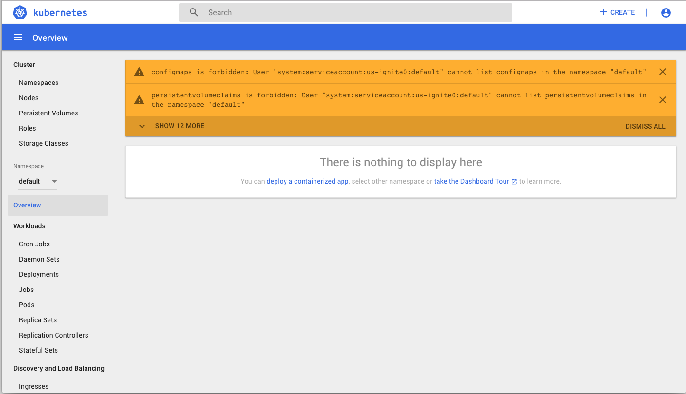
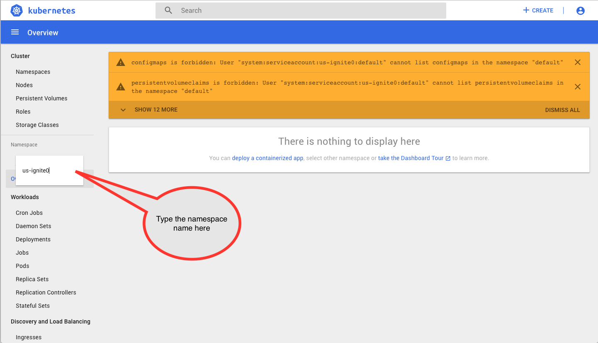
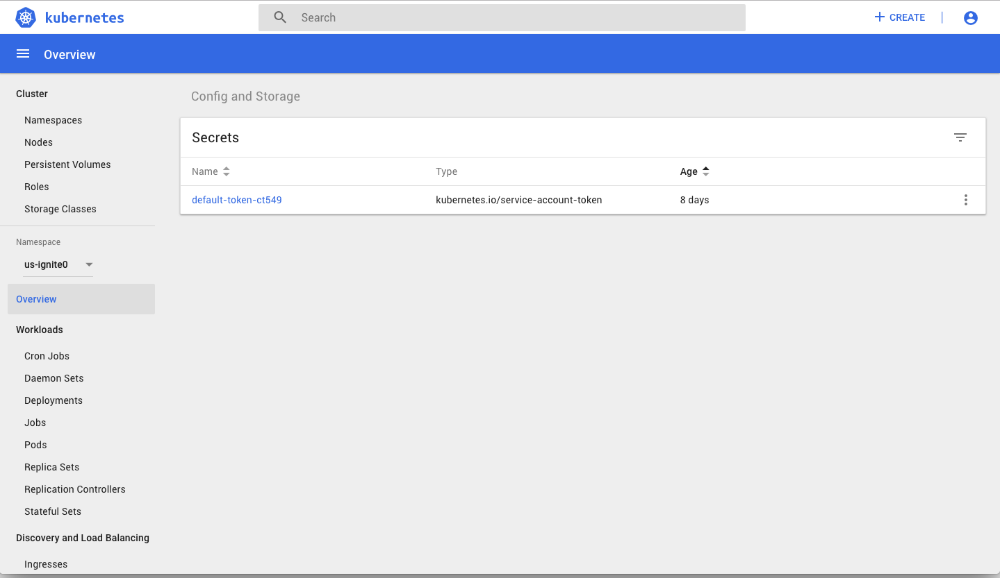

---
---

# Using EdgeNet
## The Short Version

EdgeNet is just a distributed [Kubernetes](https://kubernetes.io/)
cluster.  If you're familiar with Kubernetes, aka K8s, you can
immediately jump to the sections [K8s Concepts](#k8s-concepts),
and
[Navigating the EdgeNet Portal](#navigating-the-edgenet-portal). 
If you're not familiar with
Kubernetes, read a short description in the next section.
<!-- [Getting my Kubernetes Configuration](#k8s-config), -->


## About Kubernetes

In the beginning, there was Borg.

Borg was Google's container management system, which ran just about
every application inside Google, highly efficiently.  A [full
description](https://ai.google/research/pubs/pub43438) was given in
"Large-scale cluster management at Google
with Borg" in EuroSys 2015.  In 2014, Google
released an open-source version of Borg for public use, called
[Kubernetes](https://en.wikipedia.org/wiki/Kubernetes), or K8s.
Kubernetes is now widely used in industry for cluster and cloud
management, and there are copious tutorials and playgrounds available
for people to get familiar with Kubernetes and its use.    Indeed,
the wide variety of training materials and answers on
[StackOverflow](https://www.stackoverflow.com) and similar sites
was a strong motivation for choosing Kubernetes; there are more
training materials available than there ever were for
[GENI](http://www.geni.net/), [SAVI](https://www.savinetwork.ca/),
or [PlanetLab](https://planet-lab.org/).   We suggest new users begin with the
[Kubernetes' own tutorials](https://kubernetes.io/docs/tutorials/),
though there are many other
good choices online.  Kubernetes can be run locally using
[Minikube](https://kubernetes.io/docs/getting-started-guides/minikube/),
so you can play with it on your laptop or local server.  In addition,
there are Kubernetes profiles available on [CloudLab](https://cloudlab.us).


## K8s Concepts

A K8s deployment is called a *service*.  An instance of a service is
called a *pod*.  A pod is an ensemble of microservices, each of which
is encapsulated in a Docker container.   A developer registers his or her
pod  either with the K8s command-line controller or with the web-based
controller; assignment of pods to *worker nodes*, which are VMs or
physical machines, can be done manually
or via  the K8s scheduler.
A *daemon set* is a pod instance that should be continuously running;
full-time services are of this form.   Examples are: a persistent,
multi-tenant, distributed key-value store; or a persistent monitoring
service.  A *namespace*  is  the unit of isolation in K8s.  Namespaces
are groups of mutually-visible K8s services and daemon sets.
Namespaces are  created by the Kubernetes head node (the equivalent
of the GENI management node), and refer to a collection of services.
Namespaces are accessed by a certificate created by the head node
when the namespace is created.


### K8s Networking

It's anticipated that during the execution of a K8s pod, that the
worker node(s) on which the pod is running may fail, or the pod may
migrate across worker nodes in response to load, latency, external
demand, and so on.  As a result, K8s pods are not addressed by IP
address but by service name; the K8s proxy takes care of  resolving
pod names to addresses.  EdgeNet can host services on raw
ports; however, port contention is managed by K8s.  It is strongly
recommended that EdgeNet users use the name resolution option rather
than request direct access to external ports.


### Control of a K8s Service

A K8s service is controlled by the user from the command line of
his or her personal computer or a web interface, which he or she can run locally
through localhost or, in the alternative, can be given by the
provider.  In both cases the developer-facing tool (the web proxy
or the `kubectl` command-line program) is the primary means of
controlling, placing, running, and stopping Kubernetes pods.
Typically, a pod is declared in a `yaml` file and created using a
`kubectl` command, e.g.,

```bash
$ kubectl create -f docs/user-guide/walkthrough/pod-nginx.yaml
```

And then run with
```bash
$ kubectl run <parameters>
```

Once run, pods can be entered using the `exec` command, stopped,
started, exposed as a service, etc., using a command syntax very
similar to Docker.  One exception is that while Docker containers
are bound to a single machine, pods are bound to a cluster.
In fact, to a K8s developer using a native K8s infrastructure, it is
more or less irrelevant which VMs or physical machines within a cluster are used; assigning
pods to VMs or hardware (generally hardware; in a pure K8s environment
VMs have little value) is the job of the K8s scheduler.


## Mapping GENI Concepts to K8s

For those familiar with [GENI](http://www.geni.net/)
(others can skip to the [next section](#navigating-the-edgenet-portal)),
a K8s service corresponds fairly closely to a GENI *slice*.  The major
difference is one of perspective: a GENI slice is defined from
 the operator's perspective (it is a bag to which the developer
attaches resources) rather than from the developer's (a service is
an organized collection of execution instances which together deliver
a service to the end-user).  The K8s pod plays a role roughly
equivalent to a GENI *sliver*.   The rough equivalence is again
primarily due to the operator vs developer perspective; GENI defines
a sliver as a resource that is attached to a slice; K8s defines a
pod as a collection of containers which form the unit of instantiable
functionality for a service.   To see the difference, note that a
GENI experimenter who wished to use K8s  to deploy and organize his or her
experiment might make the reasonable choice to deploy each pod in
a VM; in this case, GENI would see each pod as a sliver.  However,
another reasonable choice, depending upon the resources consumed
by each pod, is to have multiple pods in a VM.  This would be the
preferred option when the resources demanded by a pod are relatively
modest: not only is it much more resource-efficient, a pod spins
up very rapidly, on the order of seconds; in contrast, spinning up
a VM on GENI takes about 15 minutes.   In this case, GENI would
continue to regard the VM as a sliver, and the pods, which form the
actual unit of the service, are transparent to GENI.

The unit of tenancy in K8s is the *namespace*; this is a collection
of pods that can be accessed through a single authorization
certificate, and for our purposes can be regarded as isomorphic to
a GENI *project*.


# Navigating the EdgeNet Portal

The [EdgeNet portal](https://sundewcluster.appspot.com/)
holds and manages user namespaces and configuration
files; however, management of the EdgeNet cluster is done by the
EdgeNet head node.  A user will interact with the EdgeNet portal
to get access to and configuration information for the EdgeNet head
node.  Once this is obtained, the user can use the credentials
supplied by the portal with the EdgeNet head node.  The user interacts
with the EdgeNet portal only to get his or her credentials as a configuration
file; once this is done, he or she interacts directly with the EdgeNet
head node, which is a Kubernetes head node.  When you access EdgeNet,
you'll see a brief welcome screen and a link to use EdgeNet.


Click on it. If you haven't logged in you'll be asked to login.


Sign in with your Google account.  Soon, we will offer other login
options.  Once you have signed in, you will be requested to agree to
the acceptable use policy  

Click "Agree".  At that point, you will be pending Administrator
Approval 

Once your account is approved, you will be able to download your
configuration file.


Note the name of your namespace!  This is extremely important.
Generally, it will be your email address with `@` and `.` turned into
`-`; so `rick.mcgeer@us-ignite.org` becomes `rick-mcgeer-us-ignite-org`.
Now download the configuration file and store it somewhere reasonable
on your computer, and click on "EdgeNet Head Node".  **_From here
on out, you are working with the Kubernetes Head Node!_**

Once you've clicked, you will see this screen:



The error messages in orange show that you are in the default namespace, where you have
no permissions.   We apologize; at the moment, the standard Kubernetes Dashboard doesn't permit us to assign your initial
namespace.  Just ignore these errors; the idea is to get into the right namespace.  
Click on the namespace pulldown (middle of the left-hand
side) and select the namespace name you saw in the welcome page, as in this image:


You'll see this



Cool.  You now have a Kubernetes head node, and if you've done the
Kubernetes tutorials you know what to do next.  Have fun.
